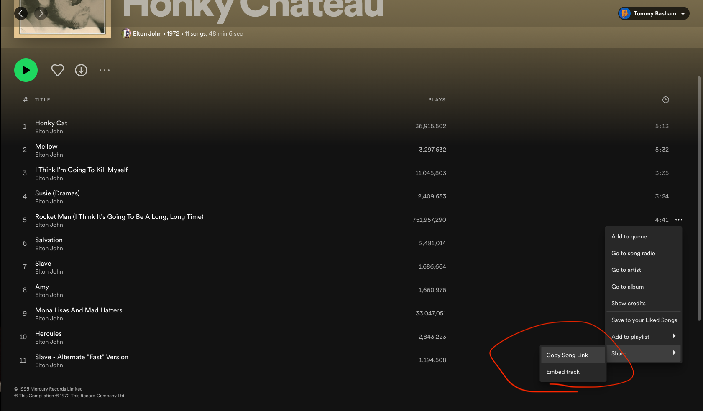

# Spotify Cover-art Serverless Function

## **Author:** Thomas Basham

### Description

This API is programmed so that you can Spotify data from any song. 
I'm using it to retrieve the cover art, however it's also useful to
retrieve html for an iFrame with a Spotify media player for that song. 

## Deployed Functions

[https://spotify-cover-art-serverless-function.vercel.app/api/spotify-data?spotifyurl= < Spotify Song Link here > ](https://spotify-cover-art-serverless-function.vercel.app/api/cover-art?spotifyurl=https://open.spotify.com/track/3gdewACMIVMEWVbyb8O9sY?si=54f5722a4c5f482e)

## How to use 

**Copy This link to get Spotify Song Link**

Then send a http GET request (or just enter into your browser)

https://spotify-cover-art-serverless-function.vercel.app/api/spotify-data?spotifyurl= < Spotify Song Link > 
## Resources
[Vercel](https://vercel.com/docs/concepts/functions/serverless-functions/supported-languages#python)

[Vercel Cli](https://vercel.com/docs/concepts/deployments/overview#vercel-cli)
